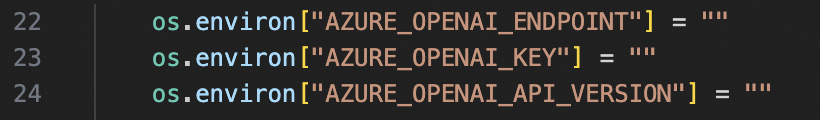
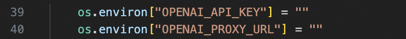

# WebDesignAgent
## Demo Video
### Auto Generation
<div align="center"><video src="https://github.com/DAMO-NLP-SG/WebDesignAgent/blob/4c23061232f733b9753f5278b2205add3ddcd226/assets/autogen.mp4"width="800"></div>
  
### Human Feedback
<div align="center"><video src="https://github.com/DAMO-NLP-SG/WebDesignAgent/blob/4c23061232f733b9753f5278b2205add3ddcd226/assets/feedback.mp4" width="800"></div>


## Quick Start

```bash
Make sure you install the google chrome
```

```bash
git clone https://github.com/DAMO-NLP-SG/WebDesignAgent.git
cd WebDesignAgent
pip install -r requirement.txt
```

Add your API_KEY

If you use Azure API
LLM.py line 22
<div style="text-align: center;">
  
</div>

elif you use Openai API

Set is_azure = False(LLM.py line 18)

LLM.py line 39
<div style="text-align: center;">
  
</div>


If you want to run in terminal
In webdesign.py line 371 set img(img path) or text

```python
agent.act(img = "1.png",text = "a shopping website")
```

And then
```bash
python webdesign.py
```


If you want to run in GUI
```python
python gui.py
```


