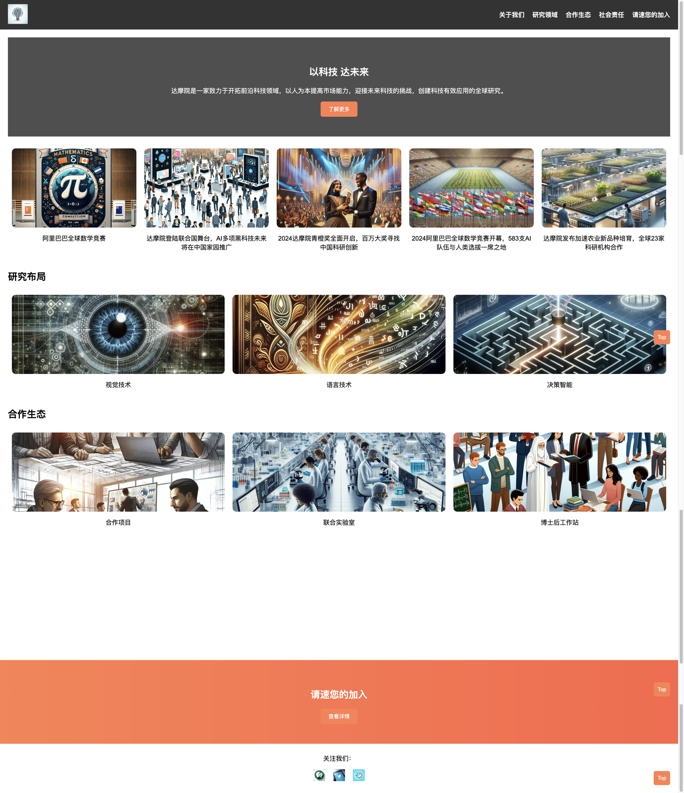
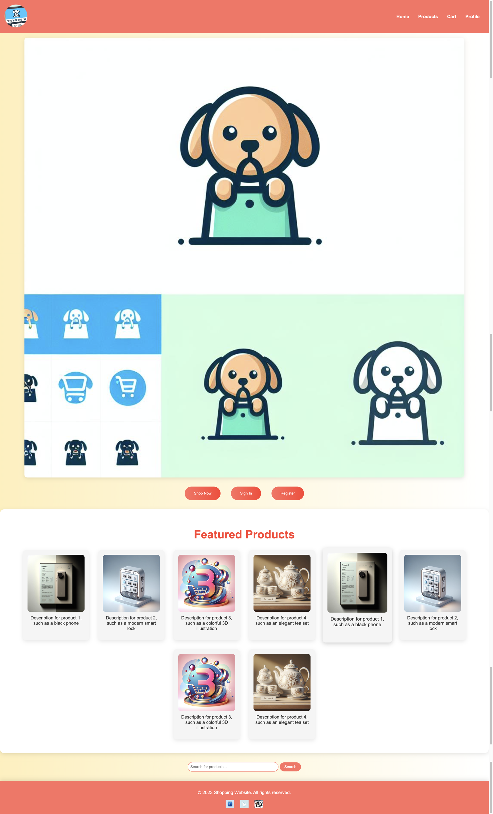

<p align="center">
<a href=""></a>
</p>


## Description
A powerful agent can help you with web design and related code generation.

It supports:
1. Generate corresponding websites based on text descriptions.
2. Generate corresponding websites based on the corresponding images.
3. Generate websites based on both text and images simultaneously.
4. Code modifications can be made based on user feedback.
5. Use visual models for React.
6. Support the generation of multiple web pages, and web pages can be connected and redirected between them.
7. Users can manually add or delete web pages and modify their content.

## Demo Video
### Auto Generation
[feedback.webm](https://github.com/DAMO-NLP-SG/WebDesignAgent/assets/109561120/63641bf7-ffb6-4518-a594-4a7223ec2899)

### Human Feedback
[auto.webm](https://github.com/DAMO-NLP-SG/WebDesignAgent/assets/109561120/d5f099e0-5a01-44fa-bb26-bf7733fd9608)

## Quick Start
```bash
git clone https://github.com/DAMO-NLP-SG/WebDesignAgent.git
cd WebDesignAgent
pip install -r requirements.txt
```

### Set config

set config.yaml
```yaml
web_type : "chrome" # "chrome" or "firefox" or "edge"

is_auzer : True # set True if you use azure openai api
AZURE_OPENAI_ENDPOINT : ""
AZURE_OPENAI_KEY : ""
AZURE_OPENAI_API_VERSION : ""

OPENAI_API_KEY : ""
OPENAI_PROXY_URL : ""
```


### Run in terminal
Our method support three ways to generate a website: 

1. Depend on a description of a website.
2. Depend on a img of a website.
3. Both on them.


Set save path and img(img path) or text
```bash
python webdesign.py --save_file "saves/shopping/" --text "a shopping website" --img "damo.png"
```


### Run in GUI
```python
python gui.py
```
Then you will enter the gui as follows:


You can select the mode between chat and web design, and choose the model.

#### Auto Generation
If you want to auto generate a website. You can follow the following steps to proceed：

1. set save file(the generated website will be saved in this file).
2. set the description of the website or give a img for website or both.
3. click plan.
4. set refine times you want.
5. click auto generation.


#### Human Feedback
If you want to generate a website more human control. You can follow the following steps to proceed：

1. set save file(the generated website will be saved in this file).
2. set the description of the website or give a img for website or both.
3. click plan.
4. click page you want to modify, and modify anything you want to change.
5. click create website.
6. enter feedback if needed and click refine website.

## Cost
When you set the refine each time to 2, generating 8 web pages would cost approximately $2 and 40 minutes.

The main cost is delle-3, which accounts for approximately 60% of the total cost. You can replace the drawing model with your own interface to reduce the cost.

Change LLM.py(_get_openai_imgs) to replace the drawing model.


## Examples
We provide three website generated by web design agent.

You can find in example/

### damo
website generated by an img(damo.png) (example/damo/index.html)
<p align="center">
<a href=""></a>
</p>

### shopping
website generated by a description(a shopping website) (example/shopping/index.html)
<p align="center">
<a href=""></a>
</p>

### game
website generated by an img(damo.png) and a description(An action game company, whose famous work is Black Myth Wukong) (example/game/index.html)

<p align="center">
<a href=""></a>
</p>

## Plan (To do)

1. Generate supporting backend code.
2. At present, this is still a relatively rough demo, and we really hope that you can provide feedback to help us improve it. We welcome you to raise issues to point out our shortcomings.
