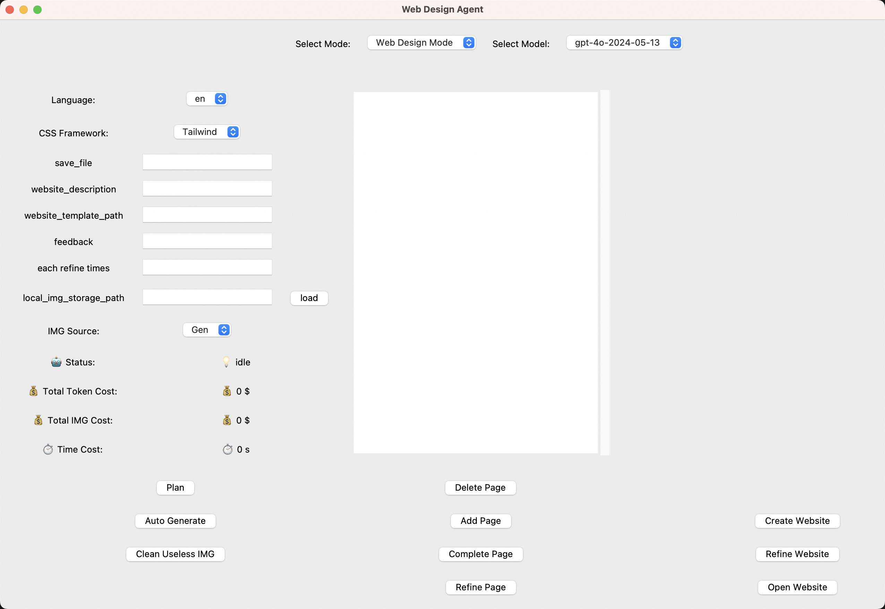

<p align="center">
<a href=""></a> 
</p>

<h3 align="center">
WebDesignAgent :  Towards Effortless Websites Creation
</h3>

<p align="center">
<a href="https://opensource.org/license/apache-2-0"></a>
<a href="https://github.com/DAMO-NLP-SG"></a>
<a></a>
<a></a>
</p>

[harry 1.webm](https://github.com/DAMO-NLP-SG/WebDesignAgent/assets/109561120/d7ddd748-00d3-47e1-96aa-5a022e857df8)

These websites are built based on the following materials:
*  A simple description: *The official website of Harry Potter, full of magical elements*
*  AI Generation Images
*  Human Feedback

[黑八戒.webm](https://github.com/DAMO-NLP-SG/WebDesignAgent/assets/109561120/f69b1992-4ef0-47e9-91ce-b0b696b581d0)

These websites are built based on the following materials:
* A reference website layout: *wukong.png*
* A simple description: *Please build official websites for Black Myth: Bajie. It requires a detailed introduction to the game as well as a history of Game Science's development. Additionally, it should provide a smart AI conversation feature with Bajie. Game Science's renowned work is Black Myth: Wukong, which has just won the 2024 TGA Game of the Year award.*
*  Local Images
*  Human Feedback

[taobao.webm](https://github.com/DAMO-NLP-SG/WebDesignAgent/assets/109561120/62f96da3-6b10-4d91-9ccb-fb2c408163bf)

These websites are built based on the following materials:
*  A reference website layout: *taobao.png*
*  AI Generation Images
*  Human Feedback


##  📰 Update
* **[2024.7.2]** WebDesignAgent can support Claude model!
* **[2024.6.28]** WebDesignAgent can arrange your images into a website!
* **[2024.6.27]** WebDesignAgent is now supporting building Chinese Websites!
* **[2024.6.26]**  The first version of WebDesignAgent!

  
## 😊 What is WebDesignAgent
WebDesignAgnet is an autonomous agent that can help you build a series of websites.

It supports building webpages with:
*  **Text → Website**: Transform your textual descriptions into fully functional, beautifully designed websites effortlessly.
*  **Images → Website**: Simply upload your images, and watch as they are seamlessly integrated into stunning websites.
*  **Visual Clues → Website**: Bring your visual layout to the websites.
*  **Hybrid Design**: Seamlessly combine text, images and other visual clues to create stunning, cohesive web designs.

It has the following key features:
*  **Multi-Page Mastery**: Generate and design interconnected web pages with dynamic redirect capabilities.
*  **User-specific Add/Delete**: Exercise full control by manually adding, deleting, or modifying web pages, their contents and their relations to tailor your site to perfection.
*  **Iterative Refinement**: Make precise alterations to your website’s code based on your invaluable feedback.
*  **Visual Reflection**: Leverage strong visual models to refine and enhance the webpage layout autonomously.

<!--
 ## Demo Video
 ### Auto Generation
 [autogen_new.webm](https://github.com/DAMO-NLP-SG/WebDesignAgent/assets/109561120/5c6eee6f-2692-420b-8c3c-681de8323b86)


 ### Create and Refine a Page
 [create_and_refine.webm](https://github.com/DAMO-NLP-SG/WebDesignAgent/assets/109561120/d2d4dc62-9737-4757-a64a-4730ae048ee8)


 ### Create a New Page
 [add_new_page.webm](https://github.com/DAMO-NLP-SG/WebDesignAgent/assets/109561120/1fbea13f-dd2f-43a3-8a67-9297fcb733ff)
-->


## 🛠️ Requirements and Installation
```bash
git clone https://github.com/DAMO-NLP-SG/WebDesignAgent.git
cd WebDesignAgent
pip install -r requirements.txt
```

### API config
set config.yaml to use the OpenAI APIs.
```yaml
web_type : "chrome" # "chrome" or "firefox" or "edge"
LLM_TYPE : "openai" # openai or claude

# LLM settings
# openai settings
is_azure : True
AZURE_OPENAI_ENDPOINT : ""
AZURE_OPENAI_KEY : ""
AZURE_OPENAI_API_VERSION : ""

AZURE_OPENAI_DALLE_ENDPOINT : ""
AZURE_OPENAI_DALLE_KEY : ""

OPENAI_API_KEY : ""
OPENAI_PROXY_URL : ""

# claude settings
CLAUDE_API_KEY : ""


# IMG Generator settings (if not set, it will use the openai settings)
IMG_GEN_TYPE : "dalle3" # "dalle3"
```

## 🚀 Quick Start
We offer two modes for using WebDesignAgent: terminal-based and GUI-based. We recommend trying the GUI mode for its user-friendly interface and greater control.


### 1. Run in GUI

```python
python gui.py
```
Then you will enter the GUI as follows:


#### Auto Generation
For a quick usage of our WebDesignAgent, please follow these steps:
1. Config `Select Mode` to `Web Design Mode`.
2. Config `Select Model` according to your APIs. In our demos, we primarily use `gpt-4o`.
3. Select the website language in the `Language` field.
4. Config `CSS Framework` to your favored style, e.g. `Tailwind`.
5. Set `save_file`, which saves your generated websites.
6. **Enter your request in either the `website_description` field for textual requests, the `website_img` field for image requests, or both for a combined input.**
7. Click the `Plan` button, which will return the textual descriptions of planned websites, their contents, and their relations. You can also change these descriptions if you find them unsuitable.
8. Click `Auto Generate` to generate all the above websites for you. The screenshot of your created websites will show on the right part of the GUI tool. (It may take some time for the entire website generation)

#### Human Feedback
If you want to generate a website with more human control. 
Following steps 1-7 in **Auto Generation** to get the automatically generated plans. Then customize your websites with the following ways:
  * You can modify the plan results by directly typing your own thoughts.
  * You can also add/delete the unsatisfied web pages.
  * You can also provide some feedback in the `feedback` field to globally control the created websites.


### 2. Run in terminal
```bash
python webdesign.py --save_file "saves/shopping/" --text "a shopping website"  --refine_times 2
```

## 👀 Examples

### 1.Alibaba DAMO
website generated by an img(damo.png) (examples/damo/index.html)
<p align="center">
<a href=""></a>
</p>

---

### 2.Shopping
website generated by a description(a shopping website) (examples/shopping/index.html)
<p align="center">
<a href=""></a>
</p>

---

### 3.Game
website generated by an img(damo.png) and a description(An action game company, whose famous work is Black Myth Wukong) (examples/game/index.html)

<p align="center">
<a href=""></a>
</p>

## 📑 TODO lists

1. Support more LLMs.
2. Support local code modification.
3. Generate supporting backend code.
4. At present, this is still a relatively rough demo, and we really hope that you can provide feedback to help us improve it. We welcome you to raise issues to point out our shortcomings.
